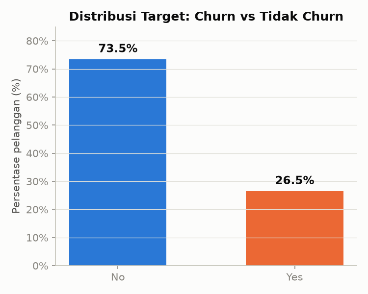
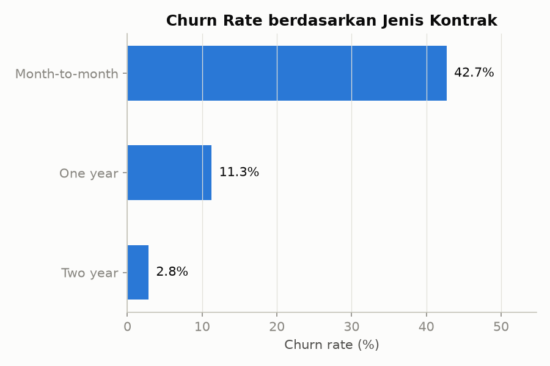
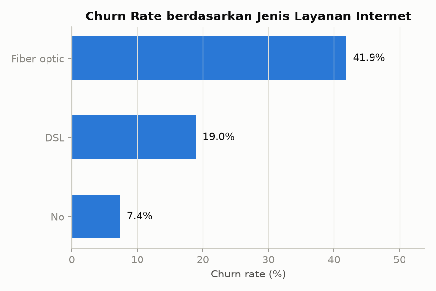
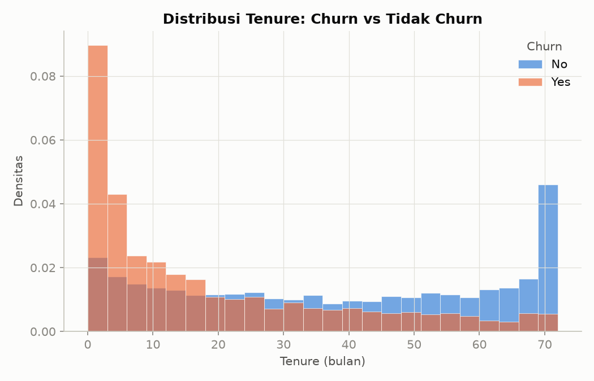
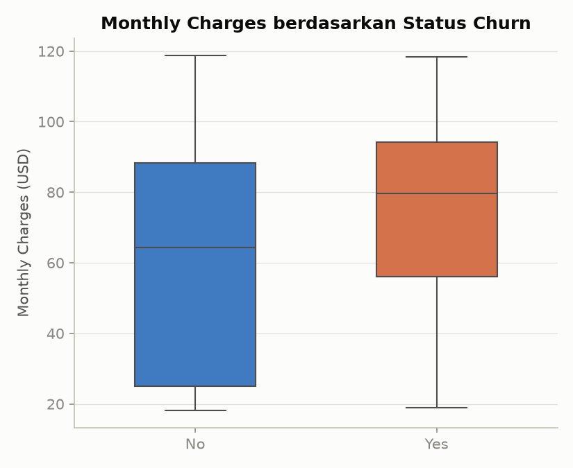
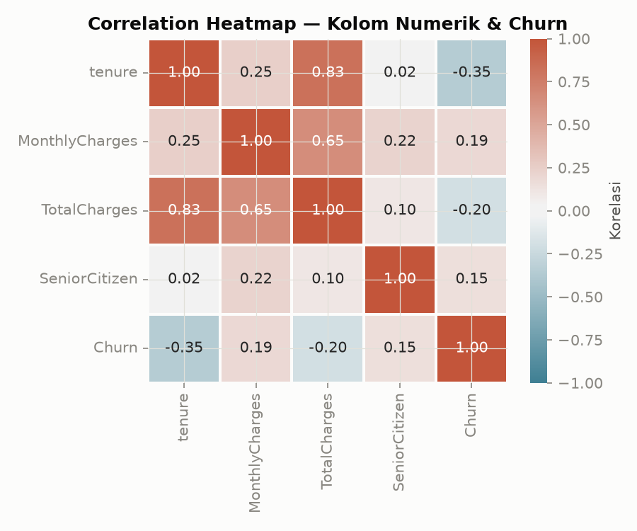
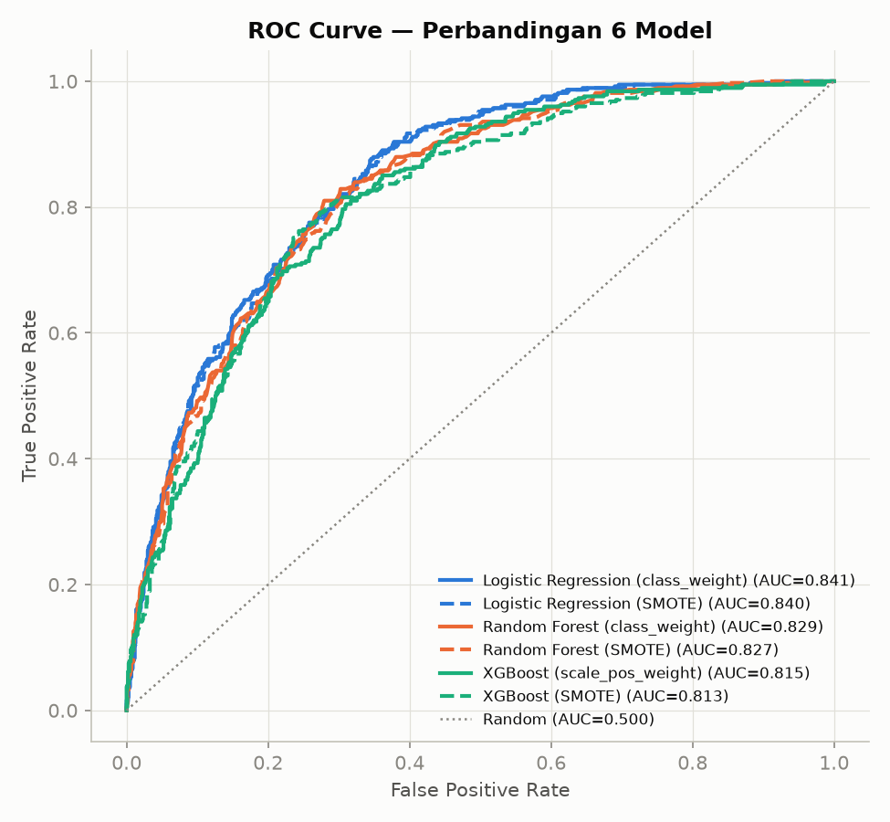
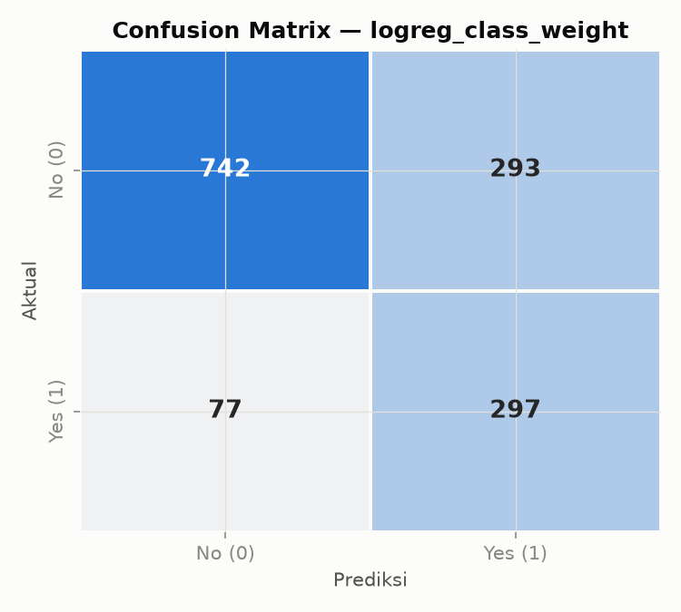
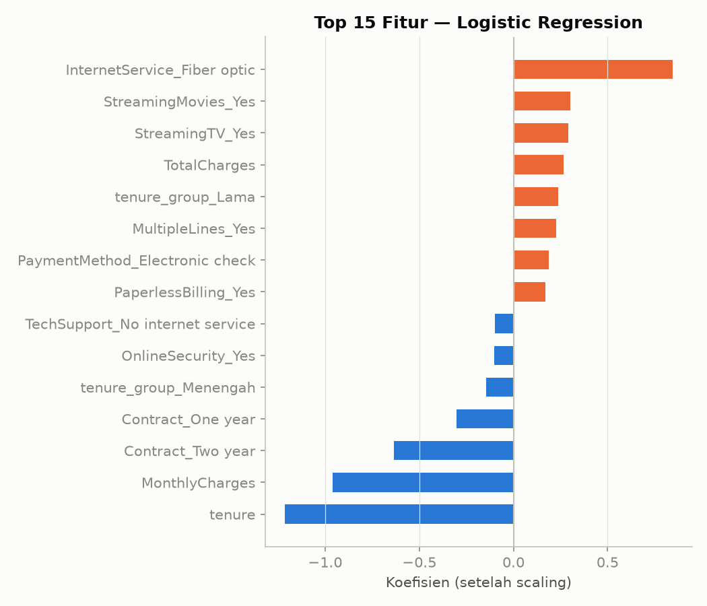
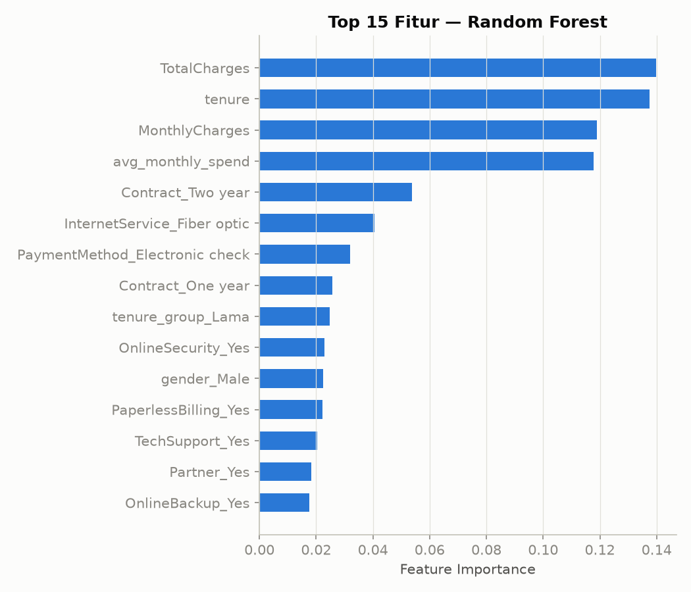

# Telco Customer Churn Prediction

Predicting which telecom customers are about to churn — and why — so a
retention team can reach out with an offer before they leave. A complete,
reproducible data science workflow: business understanding → cleaning →
EDA → feature engineering → modeling → evaluation → business
recommendations.

**Best model:** Logistic Regression · **ROC-AUC 0.84** · **Recall 79%** on the churn class (held-out test set)

---

## Table of Contents

- [Business Problem](#business-problem)
- [Dataset](#dataset)
- [Workflow](#workflow)
- [Exploratory Data Analysis](#exploratory-data-analysis)
- [Feature Engineering & Class Imbalance](#feature-engineering--class-imbalance)
- [Modeling](#modeling)
- [Evaluation](#evaluation)
- [Business Recommendations](#business-recommendations)
- [Repository Structure](#repository-structure)
- [Setup](#setup)
- [Tech Stack](#tech-stack)
- [Limitations & Future Work](#limitations--future-work)

---

## Business Problem

A telecom company loses **26.5% of its customers** every period (*churn*).
Acquiring a new customer costs far more than retaining an existing one, so
the retention team needs to know **who is likely to leave before they
actually do**, so they can be offered a retention deal first.

Three questions drive this project:

1. Which factors are most associated with customer churn?
2. Can we predict a customer's churn probability?
3. Which customer segments are highest-risk, and what should the
   retention team actually do about it?

## Dataset

- **Source:** [Telco Customer Churn](https://www.kaggle.com/datasets/blastchar/telco-customer-churn) (Kaggle, IBM sample dataset)
- **Size:** 7,043 customers × 21 columns, 1 row = 1 customer
- **Target:** `Churn` (Yes/No) — imbalanced, ~27% positive class

| Column group | Examples |
|---|---|
| Demographics | `gender`, `SeniorCitizen`, `Partner`, `Dependents` |
| Account | `tenure`, `Contract`, `PaperlessBilling`, `PaymentMethod` |
| Services | `PhoneService`, `InternetService`, `OnlineSecurity`, `TechSupport`, `StreamingTV`, … |
| Billing | `MonthlyCharges`, `TotalCharges` |

## Workflow

The project follows a full DS lifecycle, one notebook per stage:

| # | Notebook | Stage | What happens |
|---|---|---|---|
| 1 | [`01_business_data_understanding.ipynb`](notebooks/01_business_data_understanding.ipynb) | Business & Data Understanding | Business context, target definition, raw data structure (`.info()`, missing values) |
| 2 | [`02_data_cleaning.ipynb`](notebooks/02_data_cleaning.ipynb) | Data Cleaning | Fix `TotalCharges` (text → numeric, 11 blank rows), encode `SeniorCitizen`, dedupe check |
| 3 | [`03_eda.ipynb`](notebooks/03_eda.ipynb) | EDA | 6 visualizations of churn vs. contract, tenure, charges, internet service |
| 4 | [`04_feature_engineering.ipynb`](notebooks/04_feature_engineering.ipynb) | Feature Engineering | One-hot encoding, derived features, train/test split, class-imbalance handling |
| 5 | [`05_modeling.ipynb`](notebooks/05_modeling.ipynb) | Modeling | Logistic Regression baseline vs. Random Forest vs. XGBoost, 5-fold CV |
| 6 | [`06_evaluation.ipynb`](notebooks/06_evaluation.ipynb) | Evaluation | Test-set metrics, ROC curves, confusion matrix, feature importance |
| 7 | [`reports/executive_summary.md`](reports/executive_summary.md) | Communication | Business-facing summary — insights + retention recommendations |

## Exploratory Data Analysis

### Churn is imbalanced — ~27% of customers leave



### Contract type is the strongest single driver of churn

Month-to-month customers churn at **42.7%**, vs. **11.3%** for one-year
and just **2.8%** for two-year contracts.



### Fiber-optic customers churn nearly 2x more than DSL customers



### Churn is concentrated in the first few months of the relationship

Customers who churn skew heavily toward low tenure; customers who stay
are spread out, with a second spike at the top of the tenure range
(long-time loyal customers).



### Churned customers tend to pay more per month



### Correlation heatmap — numeric features & churn

`tenure` correlates negatively with churn (**-0.35**); `MonthlyCharges`
correlates positively (**+0.19**). `tenure` and `TotalCharges` are highly
correlated (**0.83**) — expected, since total billing accumulates with
tenure.



## Feature Engineering & Class Imbalance

- **Derived features:** `avg_monthly_spend` (`TotalCharges / tenure`,
  with a fallback for `tenure = 0`), `tenure_group` (Baru/Menengah/Lama —
  New/Medium/Long).
- **Encoding:** one-hot encoding for all categorical columns
  (`drop_first=True`).
- **Train/test split:** 80/20, stratified, `random_state=42` — done at
  this stage (not later) so SMOTE can be applied correctly, fit only on
  the training data.
- **Class imbalance — two strategies compared head-to-head:**
  `class_weight="balanced"` (no data change) vs. **SMOTE** oversampling
  (applied inside a pipeline, fold-safe, never leaking into validation or
  test data).

## Modeling

Three algorithms × two imbalance strategies = **6 models**, compared with
5-fold stratified cross-validation on the training set (ROC-AUC as the
primary selection metric — not accuracy, since the target is imbalanced):

| Model | ROC-AUC (CV) | F1 | Precision | Recall |
|---|---|---|---|---|
| **Logistic Regression (class_weight)** | **0.847** | 0.628 | 0.518 | **0.797** |
| Logistic Regression (SMOTE) | 0.846 | 0.633 | 0.527 | 0.792 |
| Random Forest (class_weight) | 0.831 | 0.618 | 0.585 | 0.656 |
| Random Forest (SMOTE) | 0.823 | 0.596 | 0.585 | 0.607 |
| XGBoost (scale_pos_weight) | 0.810 | 0.572 | 0.565 | 0.579 |
| XGBoost (SMOTE) | 0.799 | 0.556 | 0.560 | 0.552 |

The simple baseline — Logistic Regression — outperformed both tree-based
ensembles on this dataset, a good reminder not to skip straight to
complex models.

## Evaluation

Final metrics on the **held-out test set** (never touched during
training, CV, or SMOTE):

| Model | ROC-AUC | F1 | Precision | Recall | Accuracy |
|---|---|---|---|---|---|
| **Logistic Regression (class_weight)** | **0.842** | **0.616** | 0.503 | **0.794** | 0.737 |
| Logistic Regression (SMOTE) | 0.840 | 0.611 | 0.500 | 0.786 | 0.735 |
| Random Forest (class_weight) | 0.829 | 0.595 | 0.557 | 0.639 | 0.769 |
| Random Forest (SMOTE) | 0.827 | 0.587 | 0.571 | 0.604 | 0.774 |
| XGBoost (scale_pos_weight) | 0.815 | 0.581 | 0.559 | 0.604 | 0.769 |
| XGBoost (SMOTE) | 0.813 | 0.572 | 0.562 | 0.583 | 0.769 |

Both target metrics from the project brief are cleared: **ROC-AUC > 0.80**
and **F1 (churn class) > 0.55**.





The model catches **79% of customers who actually churn** (recall) —
useful for prioritizing outreach — at the cost of a 50% precision (about
half of flagged customers turn out to stay). That trade-off is
appropriate here: contacting a customer who wasn't going to leave is
cheap; missing one who was is expensive.

### What drives churn? (Feature importance)





Both models agree on the dominant feature group — `tenure`, billing
amounts, `Contract`, `InternetService`, and `PaymentMethod`. The most
robust, cross-validated signals (consistent across EDA, correlation, and
both models) are: **month-to-month contracts, low tenure, and fiber-optic
service push churn up; long-term contracts and add-on security services
pull it down.**

> A couple of derived/correlated features (`tenure_group`, raw
> `MonthlyCharges`) show coefficient signs that flip due to
> multicollinearity with `tenure` and `InternetService` — documented in
> [`06_evaluation.ipynb`](notebooks/06_evaluation.ipynb) so the business
> narrative relies on the stable, univariate relationships instead.

## Business Recommendations

Full write-up: **[`reports/executive_summary.md`](reports/executive_summary.md)**
(non-technical, in Bahasa Indonesia — written for the retention team).

| # | Action | Target segment |
|---|---|---|
| 1 | Offer incentives to migrate from month-to-month to 1–2 year contracts | Month-to-month customers past their first 3 months |
| 2 | Run a proactive onboarding/check-in program for the first 90 days | New customers (tenure < 3 months) |
| 3 | Re-evaluate the fiber-optic value proposition; bundle Online Security / Tech Support | Fiber-optic customers with high monthly bills |
| 4 | Investigate friction in the electronic-check payment flow; incentivize autopay | Customers paying via electronic check |
| 5 | Use the model's risk score to prioritize the retention team's contact list | Highest-risk-scored customers |

## Repository Structure

```
.
├── data/
│   ├── raw/            # original, untouched data (WA_Fn-UseC_-Telco-Customer-Churn.csv)
│   ├── interim/        # cleaned data (post Tahap 2)
│   └── processed/      # model-ready train/test splits (post Tahap 4)
├── notebooks/           # 01-06, one per project stage (see Workflow above)
├── src/                 # reusable Python modules (data loading, features, models)
├── models/              # saved/serialized trained models (*.joblib, gitignored — regenerate via 05_modeling.ipynb)
├── reports/
│   ├── executive_summary.md         # business-facing summary of findings & recommendations
│   ├── cv_model_comparison.csv      # 5-fold CV metrics, all 6 models
│   ├── test_metrics_comparison.csv  # held-out test set metrics, all 6 models
│   └── figures/                     # exported charts (used in this README)
├── tests/                # unit tests for src/
├── requirements.txt
└── setup_ds_env.sh       # re-run anytime to rebuild/refresh the environment
```

## Setup

```bash
./setup_ds_env.sh telco-churn   # creates .venv, installs deps, registers Jupyter kernel
source .venv/bin/activate
```

Or manually:

```bash
python3 -m venv .venv
source .venv/bin/activate
pip install -r requirements.txt
```

Then select the **Python (telco-churn)** kernel in Jupyter/VS Code, and
run the notebooks in order (`01` → `06`).

> XGBoost on macOS needs the OpenMP runtime: `brew install libomp`.

## Tech Stack

Python · pandas · scikit-learn · imbalanced-learn (SMOTE) · XGBoost ·
matplotlib · seaborn · Jupyter

## Limitations & Future Work

- **Precision is ~50%** — about half of flagged customers won't actually
  churn. For high-cost campaigns, the decision threshold could be tuned
  against estimated campaign cost vs. customer lifetime value, instead of
  the default 0.5.
- Some engineered/correlated features have unstable coefficient signs
  (see the Evaluation section) — deeper causal claims would need
  controlled experiments (A/B tests), not just observational coefficients.
- Stretch ideas from the original brief: SHAP/LIME for per-customer
  explainability, K-Means segmentation on top of churn scores, and a
  Streamlit/FastAPI deployment for interactive risk scoring.
